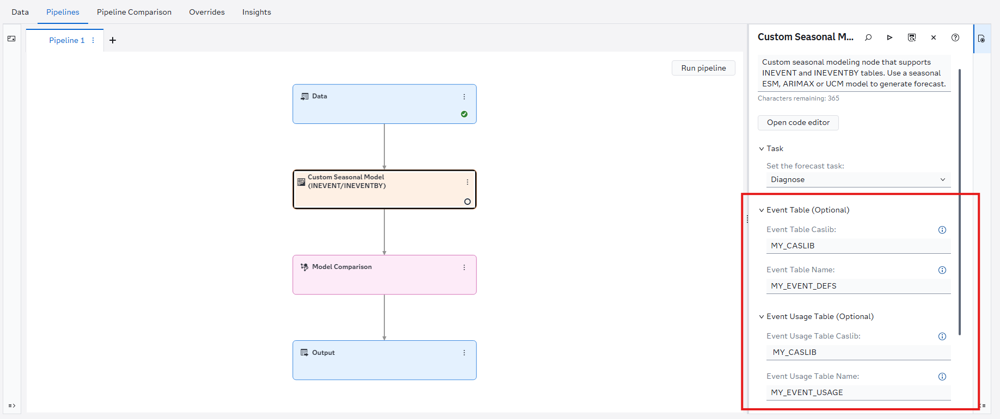

   <h1>Custom Seasonal Modeling Node</h1>

   
A custom seasonal modeling node for SAS Visual Forecasting with support for node-level event definitions and by-group-aware event mappings.

## Table of Contents

- [Overview](#overview)
- [Features](#features)
  - [Node-Level INEVENT Support](#node-level-inevent-support)
  - [Node-Level INEVENTBY Support](#node-level-ineventby-support)
  - [BY-Group-Aware Event Processing](#by-group-aware-event-processing)
  - [Backward Compatibility](#backward-compatibility)
- [Prerequisites](#prerequisites)
- [Installation](#installation)
- [Configuration](#configuration)
- [Included Sample Data](#included-sample-data)
- [Additional Resources](#additional-resources)
- [Contributing](#contributing)
- [License](#license)

## Overview

The Custom Seasonal Modeling Node extends the Seasonal Modeling Node in SAS Visual Forecasting by adding support for node-level event definitions and by-group-aware event mappings.

The node supports the following forecasting models:

- Seasonal Exponential Smoothing (ESM)
- ARIMAX
- Unobserved Components Model (UCM)

In addition to standard Seasonal Modeling functionality, this node enables:

- Node-level INEVENT tables
- Node-level INEVENTBY tables
- BY-group-specific event definitions
- HPFEVENTS and TSMODEL event repositories

This allows event configurations to be applied to a specific Seasonal Modeling Node without affecting other nodes or project-level event settings.

## Features

### Node-Level INEVENT Support

Specify an event definition table directly within the node by providing:

- Event Table Caslib (`INEVENT Caslib`)
- Event Table Name (`INEVENT Table`)

When supplied, the node-level INEVENT configuration is used for that node execution.

### Node-Level INEVENTBY Support

Specify an event usage table directly within the node by providing:

- Event Usage Table Caslib (`INEVENTBY Caslib`)
- Event Usage Table Name (`INEVENTBY Table`)

INEVENTBY can be used to control event usage and mappings for specific series or BY groups.

### BY-Group-Aware Event Processing

The node supports event repositories that contain BY variables, enabling different BY groups to use different event definitions and mappings.

### Backward Compatibility

Existing projects continue to function without modification. If node-level event properties are not configured, the node behaves the same as the standard Seasonal Modeling Node.

## Prerequisites

- SAS Viya with SAS Visual Forecasting
- Access to CAS tables containing event definitions and mappings (optional)

## Installation

1. Download the custom node package:
   - [Custom_Seasonal_Model_INEVENT_INEVENTBY.zip](Custom_Seasonal_Model_INEVENT_INEVENTBY.zip)

2. Import the ZIP file into SAS Visual Forecasting through The Exchange.

3. Add the node to a forecasting pipeline.

## Configuration

The node introduces the following optional properties:

The Event Usage Table options map to the `INEVENTBY`:

| Property                 | Description                                  |
| ------------------------ | -------------------------------------------- |
| Event Table Caslib       | Caslib containing the event definition table |
| Event Table Name         | Event definition table                       |
| Event Usage Table Caslib | Caslib containing the event usage table      |
| Event Usage Table Name   | Event usage and mapping table                |

If no event tables are specified, standard project-level event processing is used.

## Included Sample Data

This repository includes sample files that demonstrate node-level event configuration:

- [table_INEVENT_PRICEDATA.csv](data/table_INEVENT_PRICEDATA.csv)
- [table_INEVENTBY_PRICEDATA.csv](data/table_INEVENTBY_PRICEDATA.csv)
- [table_EVENT_PRICEDATA.csv](data/table_EVENT_PRICEDATA.csv)

These files can be loaded into CAS and used to test INEVENT and INEVENTBY functionality.

Please note that if an INEVENTBY table is specified, a corresponding event definition table must also be available. This can be provided either through:

The project-level INEVENT table (for example, table_EVENT_PRICEDATA), or
The node-level INEVENT table (for example, table_INEVENT_PRICEDATA).

This requirement exists because the INEVENTBY table only maps events to BY groups and series; it does not define the events themselves. The referenced event definitions must already exist in an available INEVENT repository for the INEVENTBY mappings to be applied successfully.

## Additional Resources

- [TSDF Object Documentation](https://go.documentation.sas.com/doc/en/pgmsascdc/v_075/castsp/castsp_atsm_sect004.htm)
- [EVENTBY Documentation](https://go.documentation.sas.com/doc/en/pgmsascdc/v_075/hpfug/hpfug_hpfdiag_details33.htm#hpfug.hpfdiag.diagdetaileventby)
- [BY-Group Processing and EVENTs in SAS Viya](https://communities.sas.com/t5/SAS-Communities-Library/BY-Group-Processing-and-EVENTs-in-SAS-Viya/ta-p/644142)

## Contributing

We welcome contributions!

Please read [CONTRIBUTING.md](CONTRIBUTING.md)
for details on how to submit contributions to this project.

## License

See the [LICENSE](LICENSE) file for details.

## Security

See the [SECURITY](SECURITY.md) file for details.
