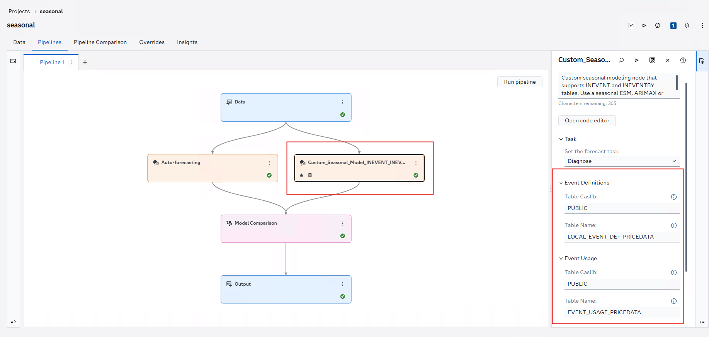

   <h1>Custom Seasonal Modeling Node</h1>

   
A custom seasonal modeling node for SAS Visual Forecasting with support for node-level event definitions and BY-group-aware event mappings.

## Table of Contents

- [Overview](#overview)
- [Features](#features)
  - [Node-Level Event Definitions Support](#node-level-event-definitions-support)
  - [Node-Level Event Usage Support](#node-level-event-usage-support)
  - [BY-Group-Aware Event Processing](#by-group-aware-event-processing)
  - [Backward Compatibility](#backward-compatibility)
- [Prerequisites](#prerequisites)
- [Installation](#installation)
- [Configuration](#configuration)
- [Included Sample Data](#included-sample-data)
- [How Event Tables Are Applied](#how-event-tables-are-applied)
- [Additional Resources](#additional-resources)
- [Contributing](#contributing)
- [License](#license)

## Overview

The Custom Seasonal Modeling Node extends the Seasonal Modeling Node in SAS Visual Forecasting by adding support for node-level event definitions and BY-group-aware event mappings.

The node supports the following forecasting models:

- Seasonal Exponential Smoothing (ESM)
- ARIMAX
- Unobserved Components Model (UCM)

In addition to [standard Seasonal Modeling functionality](https://go.documentation.sas.com/doc/en/vfcdc/v_030/vfug/n1pqtrfbcgolcyn13lwsv8hr66tl.htm#p1nrep9kcgfgh6n1bzqpe7fxlwxa), this node enables:

- Node-level Event Definitions tables
- Node-level Event Usage tables
- BY-group-specific event usage mappings
- HPFEVENTS and TSMODEL event repositories

This allows event configurations to be applied to a specific Seasonal Modeling Node without affecting other nodes.

## Features

### Node-Level Event Definitions Support

Specify an event definition table directly within the node by providing:

- Table Caslib (Event Definitions caslib)
- Table Name (Event Definitions table)

When supplied, the node-level Event Definitions configuration overrides project-level event definitions for that node execution.
When node-level Event Definitions is supplied, a valid node-level Event Usage table must also be supplied.

### Node-Level Event Usage Support

Specify an event usage table directly within the node by providing:

- Table Caslib (Event Usage caslib)
- Table Name (Event Usage table)

Event Usage maps available events to specific series or BY groups. It does not define events.
Event Definitions and Event Usage must be configured together for node-level event processing.

### BY-Group-Aware Event Processing

The event usage table can restrict event usage for selected BY groups and dependent variables. BY groups not included in the event usage table use all events available from the selected event-definition table.

### Backward Compatibility

Existing projects continue to function without modification. If node-level event properties are not configured, the node behaves the same as the standard Seasonal Modeling Node.

## Prerequisites

- SAS Viya with SAS Visual Forecasting (any supported version as of September 2026)
- Access to CAS tables containing event definitions and mappings, if configured

## Installation

1. Download the custom node package:
   - [Custom_Seasonal_Model_INEVENT_INEVENTBY.zip](Custom_Seasonal_Model_INEVENT_INEVENTBY.zip)

2. Import the ZIP file into SAS Visual Forecasting through The Exchange. See [Uploading Modeling Nodes](https://go.documentation.sas.com/doc/en/vfcdc/v_030/vfug/p1raxx0nayibr9n1ie3h14frduqs.htm#p0kxezlwkgzao5n19eyjzmiwgyiy).

3. Add the node to a forecasting pipeline.

## Configuration

The node introduces the following optional properties:

The **Event Definitions** options (underlying `INEVENT` parameter):

| Property     | Description                                  |
| ------------ | --------------------------------------------- |
| Table Caslib | Caslib containing the event-definition table |
| Table Name   | Event-definition table                       |

The **Event Usage** options (underlying `INEVENTBY` parameter):

| Property     | Description                             |
| ------------ | ---------------------------------------- |
| Table Caslib | Caslib containing the event-usage table |
| Table Name   | Event-usage and mapping table           |

If no node-level event tables are specified, standard project-level event processing is used. Specifying node-level Event Definitions without node-level Event Usage stops execution with an explicit error.

## Included Sample Data

This repository includes sample files that demonstrate node-level event configuration:

- [PRICEDATA.sashdat](data/PRICEDATA.sashdat)
- [GLOBAL_EVENT_DEF_PRICEDATA.sashdat](data/GLOBAL_EVENT_DEF_PRICEDATA.sashdat)
- [LOCAL_EVENT_DEF_PRICEDATA.sashdat](data/LOCAL_EVENT_DEF_PRICEDATA.sashdat)
- [EVENT_USAGE_PRICEDATA.sashdat](data/EVENT_USAGE_PRICEDATA.sashdat)

`PRICEDATA` is the time series data set.

`GLOBAL_EVENT_DEF_PRICEDATA` is the project-level event-definition table that can be configured under the Data tab.

`LOCAL_EVENT_DEF_PRICEDATA` is the node-level event-definition table. If it is not provided, the global event definitions are used. If it is provided, its definitions override the global definitions for this node execution and must be paired with `EVENT_USAGE_PRICEDATA`.

`EVENT_USAGE_PRICEDATA` is the node-level event-usage table paired with `LOCAL_EVENT_DEF_PRICEDATA`. It maps available events to selected BY groups and dependent variables.

## How Event Tables Are Applied

- **Global event-definition table:** Used when no local event-definition table is configured for the node.

- **Local event-definition table:** Overrides the global event-definition table for this node execution. Events defined only in the global table are not available to this node when a local table is configured.

- **Event-usage table:** Maps available events to specific BY groups and dependent variables. Its `_EVENT_` value must match an event from the selected event-definition table.

- **Sample local events:** `LOCAL_EVENT_DEF_PRICEDATA` defines the simple point events `E1` and `point1`.

- **Sample event-usage mappings:** `EVENT_USAGE_PRICEDATA` maps `E1` to the `sale` series for `Region1 / Line1 / Product1`, and `Point1` to the `sale` series for `Region1 / Line1 / Product2`. Event names are case-insensitive, so `Point1` resolves to the local `point1` definition.

- **Result:** The mappings restrict `Product1` to `E1` and `Product2` to `point1`. BY groups with no row in `EVENT_USAGE_PRICEDATA` use all events from the selected event-definition table.

## Additional Resources

- [TSDF Object Documentation](https://go.documentation.sas.com/doc/en/pgmsascdc/v_075/castsp/castsp_atsm_sect004.htm)
- [EVENTBY Documentation](https://go.documentation.sas.com/doc/en/pgmsascdc/v_075/hpfug/hpfug_hpfdiag_details33.htm#hpfug.hpfdiag.diagdetaileventby)
- [BY-Group Processing and EVENTs in SAS Viya](https://communities.sas.com/t5/SAS-Communities-Library/BY-Group-Processing-and-EVENTs-in-SAS-Viya/ta-p/644142)

## Contributing

We welcome contributions.

Please read [CONTRIBUTING.md](../../CONTRIBUTING.md) for details on how to submit contributions to this project.

## License

See the [LICENSE](../../LICENSE) file for details.

## Security

See the [SECURITY](../../SECURITY.md) file for details.
